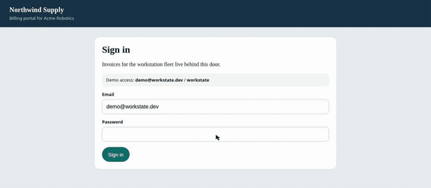
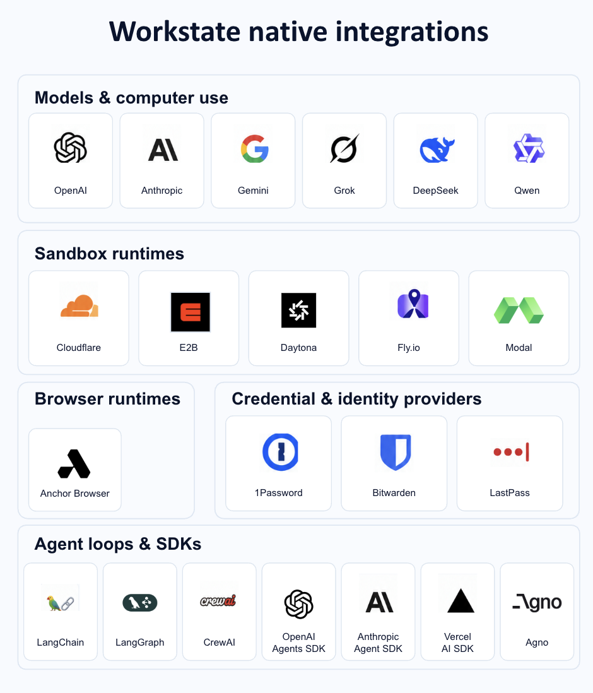

<p align="center">
  <a href="https://x.com/rauchg/status/2106848085267902815">READMEs should be written by humans, to humans.</a>
</p>

<p align="center">
  
  
  
  
</p>

<p align="center">
  <a href="./docs">Docs</a> ·
  <a href="./docs/integrations.md">Integrations</a> ·
  <a href="./examples">Examples</a> ·
  <a href="./CONTRIBUTING.md">Contributing</a>
</p>

<h1 align="center">Workstate</h1>

<p align="center">The computer SDK for developers building digital coworkers</p>

<p align="center">
  <strong>tl;dr:</strong> Workstate is an open orchestrator for virtual computer environments, optimized for digital coworker experiences. Workstate is not a sandbox - It integrates to your sandbox environment of choice, and adds on top the actual tools to make it a full pledged computer environment.
</p>

<p align="center">
  
</p>

<div align="center">

<table width="520">
  <tr>
    <td align="center" width="50%" valign="bottom">
      <a href="assets/cap-auth.mp4"></a><br /><b><a href="./docs/auth-handoff/README.md">Secure auth with computer-use</a></b>
    </td>
    <td align="center" width="50%" valign="bottom">
      <a href="assets/cap-bot.mp4"></a><br /><b><a href="./docs/bot-detection/README.md">Bot-detection bypass</a></b>
    </td>
  </tr>
  <tr>
    <td align="center" width="50%" valign="bottom">
      <a href="assets/cap-learn.mp4"></a><br /><b><a href="./docs/takeover-capture/README.md">Learn from human demonstration</a></b>
    </td>
    <td align="center" width="50%" valign="bottom">
      <a href="assets/cap-fast.mp4"></a><br /><b><a href="./docs/skill-replay/README.md">Memorize trajectories</a></b>
    </td>
  </tr>
</table>

</div>

<p align="center">Copy this prompt to your coding agent to get started.</p>

```text
Connect @workstate/sdk to the Workstate control plane with new Workstate({ url }) and environment(name). Then connect that environment to the agent loop, either through the MCP server or through env.asTool() (openai, anthropic, or execute). That is the whole integration. An Anchor API key is recommended: set it as ANCHOR_API_KEY on the Workstate server.
```

<p align="center">
  
</p>

---

## Why Workstate

Batteries included:

- ✅ Handle MFA + SSO
- ✅ Handle geo-restricted websites
- ✅ Handle enterprise VPN connection
- ✅ Securely host and use credentials
- ✅ Ask for a human in the loop
- ✅ Fast, WebRTC-based live view
- ✅ Mobile support for the live view
- ✅ Manual demonstration and replay by the agent
- ✅ Action caching
- ✅ Automatic captcha solving and dedicated fingerprinting
- ✅ Automatic token optimization
- ✅ Persistent browser profile, files, and skills
- ✅ Shell and files on the same computer
- ✅ Sub-agent tool for the parent loop
- ✅ Swap the sandbox runtime without moving the environment

---


## Quickstart

1. An Anchor API key is recommended. Set it on the Workstate server. Anchor is the browser, auth, demonstration, and task-memory layer.

```bash
export ANCHOR_API_KEY="..."
```

No key is required for development: Workstate automatically falls back to persistent local Chromium and local skills.

2. Connect the SDK to your server. The control plane is that server.

```ts
import { Workstate } from "@workstate/sdk";

const ws = new Workstate({ url: "http://127.0.0.1:4780" });
const env = await ws.environment("acme");
```

3. Connect the MCP server, or the SDK, to your agent loop.

```ts
const computer = env.asTool();

computer.openai;    // tool definition for the model call
computer.anthropic;

await computer.execute({ prompt: "Download the latest invoice from the demo shop" });
```

4. Done.

With Anchor, `env.startAnchorDemonstration(...)` creates a secure manual-demonstration link. When the demonstration finishes, poll `env.getAnchorDemonstration(id)`; Workstate records the generated Anchor Automation Task and reuses it when later prompts match. Set `anchorIdentityId` on the environment to use Anchor managed authentication. Without Anchor, `local/scripted` persists local procedures, and `browser-harness/*` can save and replay browser code through Workstate skills.

---


## Native integrations ecosystem

<p align="center">
  
</p>

---


## Environment vs. Session

An **environment** is the long-lived computer for one agent: a name, a Chromium profile, files, skills, and config.

A **session** is the live browser and shell. Workstate starts one lazily, one per environment, and runs queue on it so two tasks don't fight over the same mouse.

```text
Environment
    persistent
    │
    ├── files            /workspace
    ├── skills           /workstate/skills
    ├── browser profile
    ├── config           runtime, model, credentials, mailbox, payments
    └── artifacts
          │
          ▼
       Session
       started when a run needs it
          │
          ├── browser
          ├── shell
          └── files
```

```ts
const env = await ws.environment("my-agent");
await env.run("Summarize the front page of Hacker News");
```

Compute can stop. The logins, files, and skills stay in `~/.workstate` (or `WORKSTATE_HOME`).

---


## Use the computer directly

Already have a harness? A model adapter receives the computer, it does not go through a second agent loop.

```ts
const page = await computer.open("https://billing.example.com");
const screen = await computer.screenshot();

await computer.click(482, 316);
await computer.type("Acme Corp");
await computer.key("Enter");

const analyzed = await shell.exec("python analyze.py");
const report = await files.read("/workspace/report.csv");
```

That is the interface inside `CuaAdapter.run()`. The client SDK does not remote-control the mouse itself. It starts runs (`env.run`) and, when you want a parent agent to delegate, turns the environment into one tool.

An adapter is `{ name, available(), run() }`. Register your own with `createCustomAdapter`.

---


## Delegate computer work to a sub-agent

Your main agent does not have to spend its context window driving a browser. `asTool()` turns an environment into one function, with OpenAI and Anthropic shapes ready to pass in.

```ts
const computer = env.asTool();

computer.openai;    // { type: "function", function: { name, description, parameters } }
computer.anthropic; // { name, description, input_schema }

await computer.execute({
  prompt: "Download the latest invoice from the demo shop",
});
```

```text
parent agent
     │
     └── workstate_finance_coworker({ prompt })
             │
             ▼
       a run inside that environment
             │
             ▼
       result text + files under /workspace
```

See `[examples/parent-agent-tool](./examples/parent-agent-tool)`.

---


## Humans are part of the runtime

Computer agents get stuck. They hit sign-in walls, approvals, unfamiliar pages, and actions that should not happen without a person.

```ts
const answer = await human.request({
  kind: "approval",
  message: "Approve a single-use card for $12.80?",
});
```

```text
agent working
     ↓
human.request()
     ↓
waiting_for_human
     ↓
person opens the live view
     ↓
person finishes the action
     ↓
Return to agent
     ↓
same run continues
```

`kind` is `login`, `approval`, `input`, or `takeover`. The live view is JPEG frames over a WebSocket, every 400ms, with clicks and typing forwarded. It works in a desktop browser and on a phone. It is not VNC.

Agentcard payments use this on purpose: `card_create` asks for approval before any card exists. A decline comes back to the model as `{ approved: false }`. The run continues.

---


## The computer remembers

A skill is a JSON procedure at `/workstate/skills/<name>.json` inside the environment. The scripted adapter writes one after the demo-shop invoice run and after the Hacker News run. The next prompt that shares at least two tags replays it.

```text
/workstate/skills/download-latest-invoice.json
/workspace/invoices/INV-1042.txt
```

```json
{
  "name": "download-latest-invoice",
  "description": "Download the latest invoice from the bundled demo shop and save it under /workspace/invoices.",
  "tags": ["invoice", "download", "shop", "demo", "latest"],
  "procedure": "[{\"op\":\"open\",\"url\":\"{{serverUrl}}/demo/shop/orders\"}]"
}
```

Model adapters can call `skills_write` with whatever procedure string they understand. Only the scripted adapter replays the step language today. Recording a trajectory and turning it into a deterministic tool is the direction, not a feature in this tree:

```text
agent solves the task          ← this repo
      ↓
record the trajectory          ← not yet
      ↓
extract a reusable procedure
      ↓
run that procedure next time
      ↓
on failure, the agent repairs it
```

> **The more a coworker uses its computer, the less it should have to rediscover the job.**

---


## Workstate compounds with any sandbox runtime

Workstate runs **with** sandbox and browser providers. You pick the runtime per environment. The control plane stays the same.

The graphic at the top is the product comparison. The rows underneath are what this repository actually implements today.


|                                           | Sandbox   | Computer-use model | Workstate                    |
| ----------------------------------------- | --------- | ------------------ | ---------------------------- |
| Isolated compute                          | ✓         |                    | with Docker, E2B, or Daytona |
| Files and a shell                         | ✓         | sometimes          | ✓                            |
| Browser                                   | sometimes | ✓                  | ✓                            |
| Full desktop                              |           | sometimes          | not yet                      |
| One computer interface for every adapter  |           |                    | ✓                            |
| Run queue and a real state machine        |           |                    | ✓                            |
| Environment that outlives the session     | DIY       | DIY                | ✓                            |
| Browser profile that keeps the login      | DIY       | DIY                | ✓                            |
| Human handoff that resumes the same run   | DIY       | partial            | ✓                            |
| Environment as a tool for a parent agent  | DIY       | DIY                | ✓                            |
| Saved skills the next run can replay      | DIY       | partial            | scripted adapter             |
| Swap the runtime without moving the files |           |                    | ✓                            |
| TypeScript SDK and CLI                    | varies    | varies             | ✓                            |
| MCP server                                | varies    | varies             | not yet                      |
| Auth on the control plane                 |           |                    | not yet                      |


A runtime solves where the browser runs. Workstate solves the lifecycle around it: whose computer it is, who is allowed to touch it, and what it remembers.

---


## Examples


### Give an existing agent a computer

```ts
const tool = env.asTool();
// Pass tool.openai or tool.anthropic into the parent agent's tool list.
```


### Ask a person for help

```ts
await human.request({ kind: "login", message: "Please complete sign-in" });
```


### Drive the computer from an adapter

```ts
await computer.click(200, 140);
await computer.fill('input[type="password"]', secret);
```


### Point an environment at a runtime

```ts
await env.configure({ runtime: "daytona" });
```

See `[examples/](./examples)` for an OpenAI run, an Anthropic run, and the parent-agent tool.

---


## Open source, and the runtimes stay swappable

```text
Workstate
    │
    ├── Local Chromium          default, no key
    ├── Docker                  runtime image, untested here
    ├── Anchor · Browserbase · Steel · Kernel
    └── E2B · Daytona
```

Hosted browsers and sandboxes are adapters. Anchor is one of them: cloud Chromium over CDP, optional named profile, selected with `config.runtime = "anchor"`. It is not a hosted Workstate, and this repo does not add a proprietary control plane on top of it. The same environment can move to `local`, `e2b`, or `daytona` without moving its files or skills.

Set the provider's key on the Workstate server. Until you do, the adapter stays in the tree and the run fails with a setup error.

---


## Develop

```bash
pnpm dev           # control plane on 4780, Vite console on 4781
pnpm test          # builds the libraries, then runs the unit tests
pnpm typecheck
```

Workspace packages import each other from `dist/`, so run `pnpm build:libs` after editing a library.

```text
packages/sdk              client, Environment, asTool()
packages/server           Hono API, SQLite, runs, live WebSocket, demo shop
packages/runtime-local    Playwright computer, sandboxed files, shell
packages/runtime-docker   container daemon and the session E2B and Daytona reuse
packages/integrations     hosted browsers, sandboxes, 1Password, AgentMail, Agentcard
packages/model-adapters   scripted, OpenAI, Anthropic, Gemini, Stagehand, browser-use, browser-harness
packages/cli              the workstate command
packages/web-ui           React console
```

Start with `[docs/concepts.md](./docs/concepts.md)`, then `[docs/architecture.md](./docs/architecture.md)`, `[docs/http-api.md](./docs/http-api.md)`, `[docs/embed-node.md](./docs/embed-node.md)`, `[docs/hitl.md](./docs/hitl.md)`, `[docs/skills.md](./docs/skills.md)`, and `[docs/integrations.md](./docs/integrations.md)`. The four clips expand in [Secure auth with computer-use](./docs/auth-handoff/README.md), [Bot-detection bypass](./docs/bot-detection/README.md), [Learn from human demonstration](./docs/takeover-capture/README.md), and [Memorize trajectories](./docs/skill-replay/README.md).

> Workstate has no authentication yet. Keep it on localhost or a private network.

---


## Contributing

The most useful contributions are the ones that make the loop real in more places:

- running a model adapter or a hosted runtime with a real key, and reporting what happens
- trying the Docker image
- new adapters and runtime providers
- skill replay for model-driven runs
- example agents that do a real job

See `[CONTRIBUTING.md](./CONTRIBUTING.md)`.

---


## License

MIT. See [LICENSE](./LICENSE).

**Give your agents computers they can actually work from.**