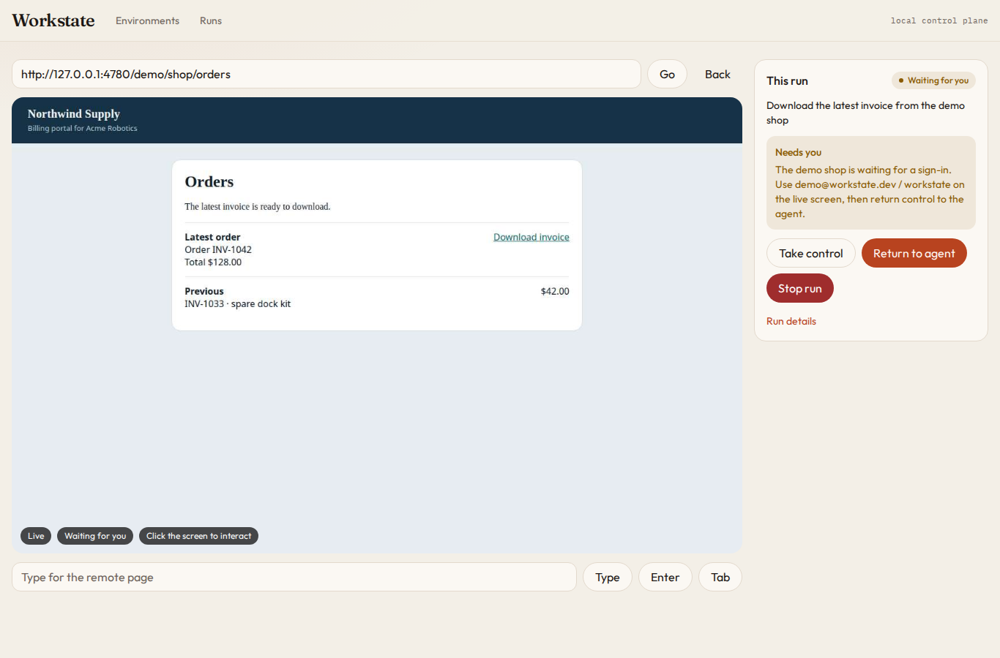
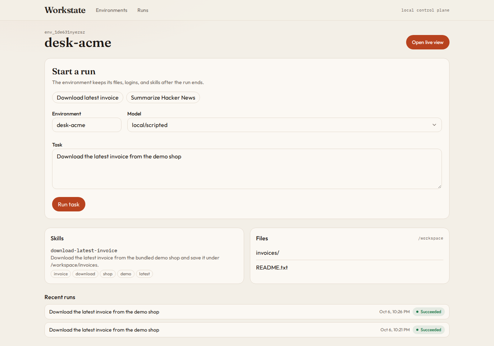

<h1 align="center">Workstate</h1>

<h3 align="center">Give your agents a computer that remembers.</h3>

<p align="center">
  A self-hosted computer for AI agents: a browser, a shell, and a filesystem that persist between runs,<br />
  a live view where a person can take over, and skills the agent saves so it doesn't ask twice.
</p>

<p align="center">
  <a href="#quickstart">Quickstart</a> ·
  <a href="./docs">Docs</a> ·
  <a href="./examples">Examples</a> ·
  <a href="#roadmap">Roadmap</a>
</p>

<p align="center">
  
</p>

Every computer-use agent hits the same wall. It opens a browser, gets to the sign-in page, and stops. Then you rebuild the same plumbing every project: a browser that keeps its cookies, a shell, files, a way for a person to step in, and a way for the agent to remember what worked.

**Workstate is that plumbing as one open-source control plane you run on your own machine.**

> A sandbox gives your agent somewhere to run.
> **Workstate gives it a computer it comes back to.**

---

## The loop, in one run

```text
agent opens the billing portal  →  hits a sign-in wall  →  asks a person
person signs in on the live view  →  clicks "Return to agent"
agent downloads the invoice  →  saves it to /workspace  →  saves a skill
next run  →  already logged in, reuses the skill, no person needed
```

That whole loop ships in this repo and runs **without an API key**. A bundled demo shop and a keyless scripted agent let you watch it end to end in a couple of minutes.

---

## Quickstart

You need Node.js 22.13+ and pnpm 10.

```bash
git clone <this repo> workstate && cd workstate
pnpm install
pnpm exec playwright install chromium
pnpm build
pnpm start
```

Open **http://127.0.0.1:4780**, click **Download latest invoice**, then **Run task**.

1. The live view opens on the Northwind Supply sign-in page, and the run says **Needs you**.
2. Click the password field on the live screen and type `workstate` (the email is prefilled as `demo@workstate.dev`). Sign in.
3. Click **Return to agent**.

The agent saves `/workspace/invoices/INV-1042.txt` and writes a `download-latest-invoice` skill. Run the same task again. It finishes on its own, because the browser profile kept the login and the skill matched.

<p align="center">
  
</p>

Prefer the terminal?

```bash
node packages/cli/dist/bin.js run --env acme "Download the latest invoice from the demo shop"
```

---

## Why Workstate

### A computer that persists

An **environment** is a named, durable computer: a Chromium profile, a `/workspace` folder, and a `/workstate/skills` folder. Close the browser, restart the server, come back next week. The logins, files, and skills are still there.

### A person is part of the runtime

When the agent can't safely continue, it calls one primitive, `human.request()`, and the run moves to `waiting_for_human`. A person opens the live view in any browser, desktop or phone, clicks and types on the real remote page, and hands control back. The same run picks up where it stopped.

### The agent remembers what worked

After a successful run, the agent can save a skill: a small JSON procedure inside the environment. The next matching task replays it instead of rediscovering the page.

```text
first run   →  agent works it out, a person helps with the login
next run    →  skill matches, saved login still valid, done
```

### Bring your own model, browser, and sandbox

Runs go through a model adapter, and sessions go through a runtime provider. The default `local/scripted` adapter needs no key and the default runtime is Chromium on your machine. Adapters for OpenAI, Anthropic, and Gemini computer use, Stagehand, browser-use, and browser-harness are included, and so are runtimes for Anchor Browser, Browserbase, Steel, Kernel, E2B, Daytona, and Docker. Or write your own: an adapter is `{ name, available(), run() }` and a runtime is `{ name, start(environment) }`.

### Logins, inboxes, and cards without leaking them

Point an environment at a 1Password item and the agent can fill a login without ever seeing the password. Give it an AgentMail inbox and it can wait for a verification code. Turn on Agentcard and it can ask a person to approve a single-use card before checkout.

---

## Use it from code

The TypeScript SDK talks to the control plane over HTTP.

```ts
import { Workstate } from "@workstate/sdk";

const ws = new Workstate(); // http://127.0.0.1:4780
const acme = await ws.environment("acme"); // created on first use, reused after

const run = await acme.run(
  { prompt: "Download the latest invoice from the demo shop" },
  { onStatus: (status) => console.log(status) },
);

console.log(run.status, run.result?.text);
// success Saved invoice INV-1042 ($128.00) to /workspace/invoices/INV-1042.txt
```

`run()` resolves when the run reaches `success`, `failed`, or `cancelled`. If it needs a person in between, it waits.

---

## Hand computer work to a sub-agent

Your main agent doesn't need to spend its context window driving a browser. `asTool()` turns an environment into one tool, with OpenAI and Anthropic shapes ready to pass in.

```ts
const tool = acme.asTool();

tool.openai;    // { type: "function", function: { name, description, parameters } }
tool.anthropic; // { name, description, input_schema }

await tool.execute({ prompt: "Download the latest invoice from the demo shop" });
```

```text
your agent
    │  calls workstate_acme({ prompt })
    ▼
Workstate run  →  browser, shell, files, skills in "acme"
    │
    ▼
result + artifacts back to your agent
```

See [`examples/parent-agent-tool`](./examples/parent-agent-tool).

---

## How it fits together

```text
              your agent / SDK / CLI / web console
                            │
                            ▼
        ┌───────────────────────────────────────┐
        │        Workstate control plane        │
        │  environments · sessions · runs       │
        │  human handoff · skills · live view   │
        │  HTTP API + WebSocket · SQLite        │
        └───────────────────┬───────────────────┘
                            │ model adapter
   local/scripted · OpenAI · Anthropic · Gemini · Stagehand · browser-use · browser-harness
                            │
                            ▼
                     runtime provider
   local Chromium · Docker · Anchor · Browserbase · Steel · Kernel · E2B · Daytona
                            │
            1Password  ·  AgentMail  ·  Agentcard  (per environment)
```

**Environment → session → run.** The environment is permanent. A session is the live browser and shell, started lazily, one per environment, so runs on the same environment queue up instead of colliding. A run moves through:

```text
queued → running → waiting_for_human → human_controlling → resumed → success | failed | cancelled
```

Everything runs on one port: the API, the live-view WebSocket, the React console, and the demo shop. State lives in `~/.workstate` (or `WORKSTATE_HOME`) as SQLite plus one folder per environment.

---

## What the agent gets

Every adapter sees the same five interfaces.

| Interface | What it does |
|---|---|
| `computer` | open, screenshot, click, double-click, move, type, key, scroll, back, page info, text, extract, fill |
| `shell` | `bash -lc` inside the environment, with `/workspace` and `/workstate/skills` mapped to real folders |
| `files` | read, write, and list, sandboxed to `/workspace` and `/workstate/skills` |
| `human` | `request({ kind: "login" \| "approval" \| "input" \| "takeover", message })` |
| `skills` | list and write the environment's saved procedures |

When the environment has them, model-driven adapters also get `credentials_fill` (1Password), `mail_wait_for_code` (AgentMail), and `card_create` (Agentcard, gated on a human approval). See [`docs/integrations.md`](./docs/integrations.md).

Paths outside the environment are rejected with a `400`, so a confused agent can't wander into the host filesystem through the files API.

---

## What's in the box

| | Status |
|---|---|
| Persistent environments (browser profile, files, skills) | Working |
| Run queue and state machine, with cancel | Working |
| Live view in the browser, desktop and mobile, with click and keyboard forwarding | Working |
| Human handoff: take control, return to agent, approve, decline, answer | Working |
| Saved skills, replayed by the scripted adapter | Working |
| Keyless `local/scripted` adapter (demo shop invoice, Hacker News front page, any URL you name) | Working |
| TypeScript SDK, `asTool()` for parent agents | Working |
| `workstate` CLI: `start`, `run`, `env`, `integrations`, `live`, `skills`, `setup` | Working |
| Bundled demo shop with a real login wall | Working |
| Per-environment runtime and service selection (CLI, API, console) | Working |
| Model adapters: OpenAI, Anthropic, Gemini computer use; Stagehand; browser-use; browser-harness | Included, not yet run with real keys |
| Runtimes: Anchor Browser, Browserbase, Steel, Kernel, E2B, Daytona, Docker | Included, not yet run with real keys or a Docker daemon |
| 1Password credentials, AgentMail inbox, Agentcard cards | Included, not yet run with real keys |

The working rows are covered by unit tests and a browser pass of the full invoice loop. The "included" rows are complete, typed code paths against each provider's documented API. Without a key the run fails with an error that names the variables to set, never with a fake success. We have not executed them against the live services yet, and we say so in `workstate integrations` and on the console's Integrations page. Reports from people who run them are very welcome.

---

## Integrations

Everything below is in the tree and selectable per environment. Keys live in the Workstate server's environment variables. `workstate integrations` prints this table with a live `configured` column.

```bash
workstate env create billing --runtime anchor --credentials op://Ops/Northwind --mailbox new --payments agentcard
workstate env set billing --model gemini/gemini-3.8-flash
workstate run --env billing "Download the latest invoice"
```

### Models and harnesses

| Model id | Needs |
|---|---|
| `local/scripted` | nothing |
| `openai/computer-use-preview` | `OPENAI_API_KEY` |
| `anthropic/claude-sonnet-4-5` | `ANTHROPIC_API_KEY` |
| `gemini/gemini-3.8-flash` | `GEMINI_API_KEY` |
| `stagehand/<provider>/<model>` | that provider's key, `@browserbasehq/stagehand` installed, a runtime with a CDP endpoint |
| `browser-use/cloud` | `BROWSER_USE_API_KEY` |
| `browser-harness/<provider>/<model>` | `OPENAI_API_KEY` or `ANTHROPIC_API_KEY`, `browser-harness` installed, a runtime with a CDP endpoint |

`WORKSTATE_DEFAULT_MODEL` picks the default. Otherwise an Anthropic key wins, then OpenAI, then Gemini, then the scripted adapter. An environment can pin its own default with `config.model`.

The scripted adapter is honest about its limits. It knows three jobs and says so when you ask for a fourth, pointing you at a model key.

### Runtimes

| `config.runtime` | What runs where | Needs |
|---|---|---|
| `local` (default) | Playwright Chromium in the server process, one persistent profile per environment. `WORKSTATE_HEADLESS=0` shows the window. | nothing |
| `docker` | Browser, shell, and files inside a `workstate/runtime:0.1` container | a Docker daemon and the image |
| `anchor` | Anchor Browser cloud Chromium over CDP, shell and files on the host | `ANCHOR_API_KEY` |
| `browserbase` | Browserbase cloud Chromium over CDP | `BROWSERBASE_API_KEY`, `BROWSERBASE_PROJECT_ID` |
| `steel` | Steel cloud (or self-hosted) Chromium over CDP | `STEEL_API_KEY` |
| `kernel` | Kernel cloud Chromium over CDP | `KERNEL_API_KEY` |
| `e2b` | Browser, shell, and files inside an E2B sandbox running the runtime image | `E2B_API_KEY`, `e2b` installed, a template built from the Dockerfile |
| `daytona` | Browser, shell, and files inside a Daytona sandbox running the runtime image | `DAYTONA_API_KEY`, `@daytona/sdk` installed |

```bash
docker build -f packages/runtime-docker/Dockerfile -t workstate/runtime:0.1 .
```

### Services

| Config | Provider | Needs |
|---|---|---|
| `credentials = op://Vault/Item` | 1Password, service account SDK or Connect server | `OP_SERVICE_ACCOUNT_TOKEN`, or `OP_CONNECT_HOST` + `OP_CONNECT_TOKEN` |
| `mailbox = <inbox>` or `new` | AgentMail | `AGENTMAIL_API_KEY` |
| `payments = agentcard` | Agentcard | `AGENTCARD_CLIENT_ID`, `AGENTCARD_CLIENT_SECRET`, `AGENTCARD_CARDHOLDER_ID` |

Every variable, default, and known gap is in [`docs/integrations.md`](./docs/integrations.md).

---

## CLI

```bash
workstate start --host 0.0.0.0 --port 4780 --no-open
workstate run --env acme "Download the latest invoice from the demo shop"
workstate run --env research-bot "Summarize the front page of Hacker News"
workstate env create research-bot --runtime browserbase --model openai/computer-use-preview
workstate env set research-bot --credentials op://Ops/Research --no-payments
workstate env list
workstate integrations
workstate live acme
workstate skills list --env acme
```

From a clone, `workstate` is `node packages/cli/dist/bin.js`. `run`, `env`, and `skills` start an embedded server if nothing is listening. Add `--url` to target a running one, or `--json` for machine-readable output.

---

## Roadmap

**Shipped in this repo**

- environments, sessions, and the run state machine
- local Playwright runtime, Docker, four hosted-browser runtimes, two sandbox runtimes
- live view with human takeover and return
- keyless scripted agent; OpenAI, Anthropic, Gemini, Stagehand, browser-use, and browser-harness adapters
- 1Password credentials, AgentMail inbox, Agentcard cards with human approval
- saved skills and replay
- TypeScript SDK, `asTool()`, CLI, web console

**Next**

- run every "included, not yet run" integration against real keys and fix what breaks
- expose a CDP endpoint from the Docker, E2B, and Daytona sessions so Stagehand and browser-harness can attach to them
- skill replay for model-driven runs, not only the scripted adapter
- record successful trajectories and turn them into skills automatically
- an MCP server over the same environment
- a Python SDK
- full desktop sessions, beyond the browser
- authentication for the control plane, so it can leave localhost

---

## The five-minute test

Someone who has never built a computer-use agent should be able to clone this repo and, within five minutes:

- watch an agent drive a real browser
- take over when it hits a login wall
- hand the computer back
- see the next run finish on its own

If the quickstart above doesn't get you there, that's a bug. Please open an issue.

---

## Develop

```bash
pnpm dev           # control plane on 4780, Vite console with hot reload on 4781
pnpm test          # builds the libraries, then runs the unit tests
pnpm typecheck
```

Workspace packages import each other from `dist/`, so run `pnpm build:libs` after editing a library.

```text
packages/sdk              client, Environment, asTool()
packages/server           Hono API, SQLite, runs, live WebSocket, demo shop
packages/runtime-local    Playwright computer, sandboxed files, shell
packages/runtime-docker   container daemon and remote session (also used by E2B and Daytona)
packages/integrations     hosted browsers, sandboxes, 1Password, AgentMail, Agentcard, registry
packages/model-adapters   scripted, OpenAI, Anthropic, Gemini, Stagehand, browser-use, browser-harness, custom
packages/cli              the workstate command
packages/web-ui           React console
examples                  OpenAI, Anthropic, parent-agent tool
docs                      concepts, architecture, human handoff, skills, integrations
```

Start with [`docs/concepts.md`](./docs/concepts.md), then [`docs/architecture.md`](./docs/architecture.md), [`docs/hitl.md`](./docs/hitl.md), [`docs/skills.md`](./docs/skills.md), and [`docs/integrations.md`](./docs/integrations.md).

> Workstate has no authentication yet. Keep it on localhost or a private network.

---

## Contributing

Workstate is early, and the most useful contributions are the ones that make the loop real in more places:

- running any of the included model adapters, hosted browsers, or sandboxes with a real key and reporting what happens
- trying the Docker runtime
- new model adapters, runtime providers, and services
- better skill formats and replay
- example agents that do a real job

Open an issue or a pull request.

---

## License

MIT. See [LICENSE](./LICENSE).

<p align="center">
  <strong>Give your agents a computer that remembers.</strong>
</p>
