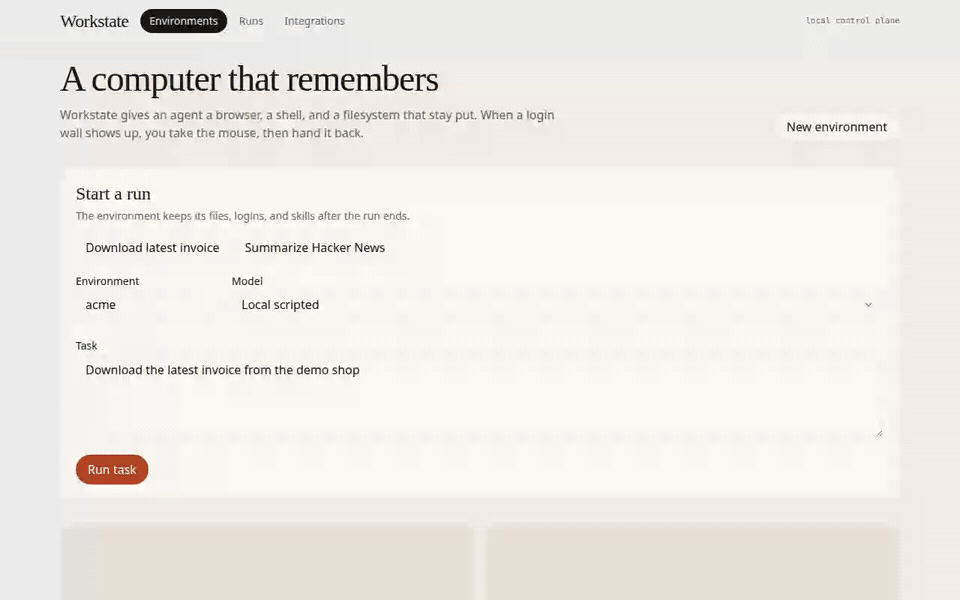
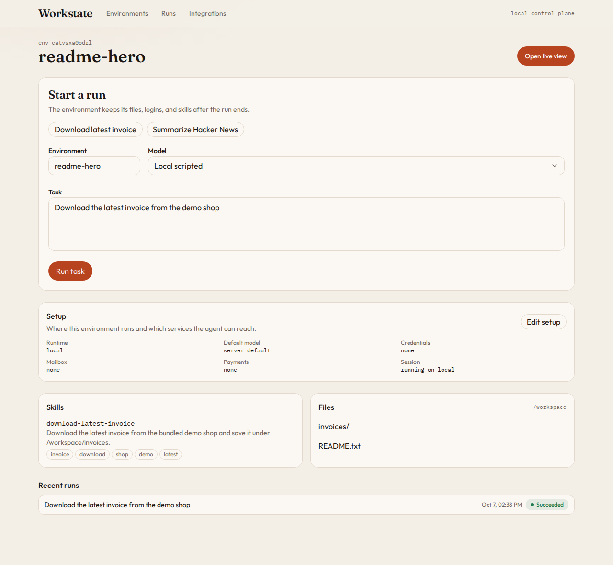
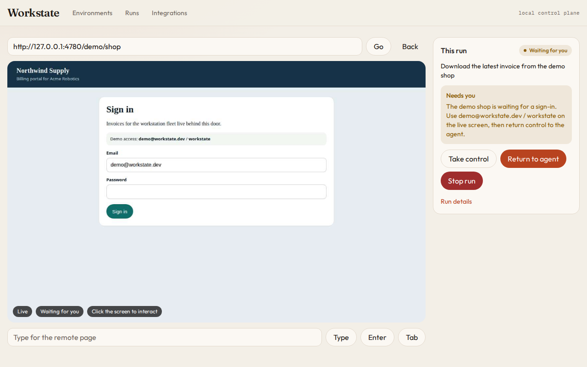
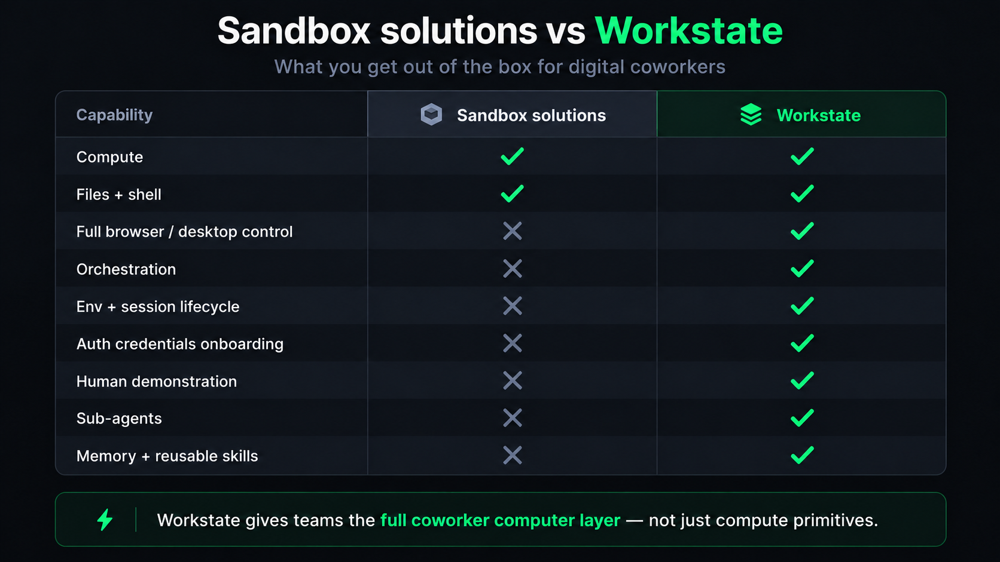
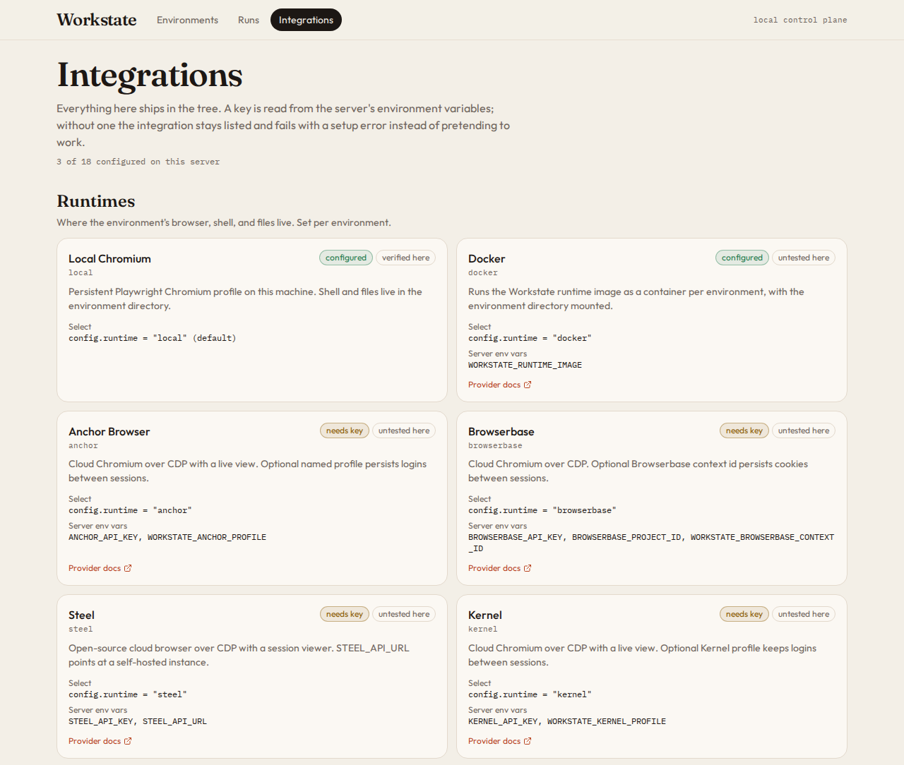

<p align="center">
  
</p>

<h1 align="center">Give your agents computers they can actually work from.</h1>

<p align="center">
  The open-source computer harness for people building agents that come back tomorrow.
</p>

<p align="center">
  <a href="https://img.shields.io/badge/license-MIT-b8431f"></a>
  <a href="https://img.shields.io/badge/node-%E2%89%A522.13-1c1714"></a>
  <a href="https://img.shields.io/badge/typescript-5.9-3178c6"></a>
  <a href="https://img.shields.io/badge/API%20key-not%20required-1f7a4d"></a>
</p>

<p align="center">
  <a href="./docs">Docs</a> ·
  <a href="./docs/integrations.md">Integrations</a> ·
  <a href="./examples">Examples</a> ·
  <a href="./CONTRIBUTING.md">Contributing</a>
</p>

<p align="center">
  <a href="assets/workstate-demo.mp4">
    
  </a>
</p>

Building an agent that uses a computer means solving the same infrastructure over and over: a browser that keeps its cookies, a shell, files, a place for a person to step in, and a way to reuse what worked.

**Workstate turns that into one open control plane you run yourself.**

> A sandbox gives your agent somewhere to run.
> **Workstate gives it a computer it comes back to.**

The loop in the video ships in this repo and runs **without an API key**. A bundled demo shop and a keyless scripted agent let you watch it end to end.

---

## Why Workstate

### Run the computer agent for you

Use a scripted agent, a computer-use model, or a harness. Workstate handles the environment, the session, the run, and the handoff.

```ts
import { Workstate } from "@workstate/sdk";

const ws = new Workstate(); // http://127.0.0.1:4780
const env = await ws.environment("finance-coworker");

const result = await env.run(
  {
    prompt: "Download the latest invoice from the demo shop",
    model: "anthropic/claude-sonnet-4-5",
  },
  { onStatus: (status) => console.log(status) },
);
```

Leave `model` off and the run uses `local/scripted`, which needs no key.

### Bring in a human when needed

Sign-in, MFA, an approval, or anything the agent should not finish alone. Inside a run the agent calls one primitive:

```ts
await human.request({
  kind: "login",
  message: "Please finish signing in",
});
```

The run moves to `waiting_for_human`. A person opens the live view, uses the real page, and clicks **Return to agent**. The same run continues.

### Remember what worked

Successful computer work can be saved as a skill inside the environment. The scripted adapter replays a matching skill on the next run instead of starting over.

```text
first run   → agent works it out, a person helps with the login
next run    → skill matches, saved login still valid, no person needed
```

<p align="center">
  
</p>

---

## Quickstart

You need Node.js 22.13+ and pnpm 10. Workstate is not published to a package registry yet; you run it from a clone.

```bash
git clone <this repo> workstate && cd workstate
pnpm install
pnpm exec playwright install chromium
pnpm build
pnpm start
```

Open **http://127.0.0.1:4780**, click **Download latest invoice**, then **Run task**.

1. The live view opens on the Northwind Supply sign-in page. The run says **Needs you**.
2. Click the password field and type `workstate`. The email is already `demo@workstate.dev`. Sign in.
3. Click **Return to agent**.

The agent saves `/workspace/invoices/INV-1042.txt` and writes a `download-latest-invoice` skill. Run the same task again. It finishes on its own.

Prefer the terminal?

```bash
node packages/cli/dist/bin.js run --env acme "Download the latest invoice from the demo shop"
```

---

## One interface above the computer infrastructure

```text
                     your product
                          │
                      your agent
                          │
                          ▼
              ┌─────────────────────┐
              │      WORKSTATE      │
              │                     │
              │    Control plane    │
              │  environments       │
              │  sessions           │
              │  runs               │
              │  human handoff      │
              │  skills             │
              │                     │
              │   Computer API      │
              │   TypeScript SDK    │
              └──────────┬──────────┘
                         │
       ┌─────────────────┼──────────────────┐
       ▼                 ▼                  ▼
     Local            Daytona             Anchor
       │                 │                  │
       └── Docker · E2B · Browserbase · Steel · Kernel
```

**Control plane.** Environments, sessions, the run state machine, runtime routing, human intervention, skills, files, and the live view. HTTP, a WebSocket, and SQLite, on one port.

**Computer interface.** What a specific agent sees during a run: screenshots, mouse, keyboard, browser, shell, files, and `human.request()`.

There is no MCP server and no Python SDK yet. Both are on the roadmap. Today the surfaces are the TypeScript SDK, the `workstate` CLI, and the web console.

---

## Built for agents that have a job

Workstate is for long-lived agents that operate real software on someone's behalf, more than once.

**Assistants · finance · sales · recruiting · support · IT · research**

Those products already have their own model, memory, and product UI. Workstate does not replace them. It is the **computer layer**: a browser profile, a workspace, and a person in the loop.

If you only need a throwaway shell, use a sandbox.

If the agent needs to come back tomorrow and still be logged in, Workstate is the piece that holds that.

---

## Environment vs. Session

An **environment** is the long-lived computer for one agent: a name, a Chromium profile, files, skills, and config.

A **session** is the live browser and shell. Workstate starts one lazily, one per environment, and runs queue on it so two tasks don't fight over the same mouse.

```text
Environment
    persistent
    │
    ├── files            /workspace
    ├── skills           /workstate/skills
    ├── browser profile
    ├── config           runtime, model, credentials, mailbox, payments
    └── artifacts
          │
          ▼
       Session
       started when a run needs it
          │
          ├── browser
          ├── shell
          └── files
```

```ts
const env = await ws.environment("my-agent");
await env.run("Summarize the front page of Hacker News");
```

Compute can stop. The logins, files, and skills stay in `~/.workstate` (or `WORKSTATE_HOME`).

---

## Use the computer directly

Already have a harness? A model adapter receives the computer, it does not go through a second agent loop.

```ts
const page = await computer.open("https://billing.example.com");
const screen = await computer.screenshot();

await computer.click(482, 316);
await computer.type("Acme Corp");
await computer.key("Enter");

const analyzed = await shell.exec("python analyze.py");
const report = await files.read("/workspace/report.csv");
```

That is the interface inside `CuaAdapter.run()`. The client SDK does not remote-control the mouse itself. It starts runs (`env.run`) and, when you want a parent agent to delegate, turns the environment into one tool.

An adapter is `{ name, available(), run() }`. Register your own with `createCustomAdapter`.

---

## Delegate computer work to a sub-agent

Your main agent does not have to spend its context window driving a browser. `asTool()` turns an environment into one function, with OpenAI and Anthropic shapes ready to pass in.

```ts
const computer = env.asTool();

computer.openai;    // { type: "function", function: { name, description, parameters } }
computer.anthropic; // { name, description, input_schema }

await computer.execute({
  prompt: "Download the latest invoice from the demo shop",
});
```

```text
parent agent
     │
     └── workstate_finance_coworker({ prompt })
             │
             ▼
       a run inside that environment
             │
             ▼
       result text + files under /workspace
```

See [`examples/parent-agent-tool`](./examples/parent-agent-tool).

---

## Humans are part of the runtime

Computer agents get stuck. They hit sign-in walls, approvals, unfamiliar pages, and actions that should not happen without a person.

```ts
const answer = await human.request({
  kind: "approval",
  message: "Approve a single-use card for $12.80?",
});
```

```text
agent working
     ↓
human.request()
     ↓
waiting_for_human
     ↓
person opens the live view
     ↓
person finishes the action
     ↓
Return to agent
     ↓
same run continues
```

`kind` is `login`, `approval`, `input`, or `takeover`. The live view is JPEG frames over a WebSocket, every 400ms, with clicks and typing forwarded. It works in a desktop browser and on a phone. It is not VNC.

<p align="center">
  
</p>

Agentcard payments use this on purpose: `card_create` asks for approval before any card exists. A decline comes back to the model as `{ approved: false }`. The run continues.

---

## The computer remembers

A skill is a JSON procedure at `/workstate/skills/<name>.json` inside the environment. The scripted adapter writes one after the demo-shop invoice run and after the Hacker News run. The next prompt that shares at least two tags replays it.

```text
/workstate/skills/download-latest-invoice.json
/workspace/invoices/INV-1042.txt
```

```json
{
  "name": "download-latest-invoice",
  "description": "Download the latest invoice from the bundled demo shop and save it under /workspace/invoices.",
  "tags": ["invoice", "download", "shop", "demo", "latest"],
  "procedure": "[{\"op\":\"open\",\"url\":\"{{serverUrl}}/demo/shop/orders\"}]"
}
```

Model adapters can call `skills_write` with whatever procedure string they understand. Only the scripted adapter replays the step language today. Recording a trajectory and turning it into a deterministic tool is the direction, not a feature in this tree:

```text
agent solves the task          ← this repo
      ↓
record the trajectory          ← not yet
      ↓
extract a reusable procedure
      ↓
run that procedure next time
      ↓
on failure, the agent repairs it
```

> **The more a coworker uses its computer, the less it should have to rediscover the job.**

---

## Workstate is not another sandbox

Workstate runs **with** sandbox and browser providers. You pick the runtime per environment. The control plane stays the same.

<p align="center">
  
</p>

The marks above are the product comparison. The rows underneath are what this repository actually implements today.

| | Sandbox | Computer-use model | Workstate |
|---|:---:|:---:|:---:|
| Isolated compute | ✓ |  | with Docker, E2B, or Daytona |
| Files and a shell | ✓ | sometimes | ✓ |
| Browser | sometimes | ✓ | ✓ |
| Full desktop |  | sometimes | not yet |
| One computer interface for every adapter |  |  | ✓ |
| Run queue and a real state machine |  |  | ✓ |
| Environment that outlives the session | DIY | DIY | ✓ |
| Browser profile that keeps the login | DIY | DIY | ✓ |
| Human handoff that resumes the same run | DIY | partial | ✓ |
| Environment as a tool for a parent agent | DIY | DIY | ✓ |
| Saved skills the next run can replay | DIY | partial | scripted adapter |
| Swap the runtime without moving the files |  |  | ✓ |
| TypeScript SDK and CLI | varies | varies | ✓ |
| MCP server | varies | varies | not yet |
| Auth on the control plane |  |  | not yet |

A runtime solves where the browser runs. Workstate solves the lifecycle around it: whose computer it is, who is allowed to touch it, and what it remembers.

---

## Models, harnesses, runtimes

Everything below is in the tree. `workstate integrations` prints the live table, including which variables are set on this server. Without a key, a run that needs one **fails** and names the variable. Nothing is stubbed to look successful.

<p align="center">
  
</p>

### Models and harnesses

| Model id | Needs |
|---|---|
| `local/scripted` | nothing. Demo-shop invoice, Hacker News, or an explicit URL. |
| `openai/computer-use-preview` | `OPENAI_API_KEY` |
| `anthropic/claude-sonnet-4-5` | `ANTHROPIC_API_KEY` |
| `gemini/gemini-3.8-flash` | `GEMINI_API_KEY` |
| `stagehand/<provider>/<model>` | that provider's key, `@browserbasehq/stagehand` installed, and a runtime with a CDP URL |
| `browser-use/cloud` | `BROWSER_USE_API_KEY` |
| `browser-harness/<provider>/<model>` | `OPENAI_API_KEY` or `ANTHROPIC_API_KEY`, the `browser-harness` CLI, and a CDP URL |

Only `local/scripted` has been executed in this repo. The others are real clients against each provider's API. OpenAI and Anthropic safety checks, and Gemini `safety_decision`, are routed to a human approval.

### Runtimes

**Local · Docker · Anchor · Browserbase · Steel · Kernel · E2B · Daytona**

`local` is in-process Playwright, one Chromium profile per environment. Anchor, Browserbase, Steel, and Kernel are hosted Chromium over CDP; the shell and files stay on the Workstate machine. Docker, E2B, and Daytona run the Workstate runtime image, so the browser, shell, and files all live in the sandbox. Docker, E2B, and Daytona do not expose a CDP URL yet, so Stagehand and browser-harness cannot attach to them.

### Services

| On the environment | What the agent gets |
|---|---|
| `credentials: "op://Vault/Item"` | 1Password. `credentials_fill` types the login. The secret never enters the model transcript. |
| `mailbox: "<inbox>"` or `"new"` | AgentMail. Address, inbox listing, and a wait-for-code tool. |
| `payments: "agentcard"` | A single-use card, only after a person approves it in the live view. |

```bash
workstate env create billing \
  --runtime anchor \
  --model gemini/gemini-3.8-flash \
  --credentials op://Ops/Northwind \
  --mailbox new \
  --payments agentcard
```

Same fields in the console under **New environment** and **Edit setup**, or `env.configure({...})` in the SDK. The full variable list, defaults, and known gaps are in [`docs/integrations.md`](./docs/integrations.md).

---

## Examples

### Give an existing agent a computer

```ts
const tool = env.asTool();
// Pass tool.openai or tool.anthropic into the parent agent's tool list.
```

### Ask a person for help

```ts
await human.request({ kind: "login", message: "Please complete sign-in" });
```

### Drive the computer from an adapter

```ts
await computer.click(200, 140);
await computer.fill('input[type="password"]', secret);
```

### Point an environment at a runtime

```ts
await env.configure({ runtime: "daytona" });
```

See [`examples/`](./examples) for an OpenAI run, an Anthropic run, and the parent-agent tool.

---

## Open source, and the runtimes stay swappable

```text
Workstate
    │
    ├── Local Chromium          default, no key
    ├── Docker                  runtime image, untested here
    ├── Anchor · Browserbase · Steel · Kernel
    └── E2B · Daytona
```

Hosted browsers and sandboxes are adapters. Anchor is one of them: cloud Chromium over CDP, optional named profile, selected with `config.runtime = "anchor"`. It is not a hosted Workstate, and this repo does not add a proprietary control plane on top of it. The same environment can move to `local`, `e2b`, or `daytona` without moving its files or skills.

Set the provider's key on the Workstate server. Until you do, the adapter stays in the tree and the run fails with a setup error.

---

## Roadmap

**In this repo**

- environments, sessions, and the run state machine
- local Playwright, plus Docker, E2B, and Daytona adapters
- Anchor, Browserbase, Steel, and Kernel over CDP
- live view, takeover, and return, on desktop and mobile
- keyless scripted agent
- OpenAI, Anthropic, and Gemini computer-use adapters
- Stagehand, browser-use, and browser-harness adapters
- 1Password, AgentMail, and Agentcard
- skills the scripted adapter replays
- TypeScript SDK, `asTool()`, CLI, web console

**Not built yet**

- running each hosted adapter against a real key and fixing what breaks
- a CDP URL from Docker, E2B, and Daytona, so Stagehand and browser-harness can attach
- recorded trajectories, manual demonstrations, and skill repair
- skill replay for model-driven runs, not only the scripted adapter
- an MCP server and a Python SDK
- Windows and macOS sessions, beyond the browser
- authentication on the control plane, so it can leave localhost

---

## The five-minute test

Someone who has never built a computer-use agent should be able to clone this repo and, within five minutes:

```bash
pnpm install && pnpm exec playwright install chromium && pnpm build && pnpm start
```

then click **Download latest invoice** and:

- watch an agent drive a real browser
- take over when it hits the sign-in wall
- hand the computer back
- run it again and watch it finish alone

If that still means stitching five products together before anything moves, Workstate has not done its job. Please open an issue.

---

## Develop

```bash
pnpm dev           # control plane on 4780, Vite console on 4781
pnpm test          # builds the libraries, then runs the unit tests
pnpm typecheck
```

Workspace packages import each other from `dist/`, so run `pnpm build:libs` after editing a library.

```text
packages/sdk              client, Environment, asTool()
packages/server           Hono API, SQLite, runs, live WebSocket, demo shop
packages/runtime-local    Playwright computer, sandboxed files, shell
packages/runtime-docker   container daemon and the session E2B and Daytona reuse
packages/integrations     hosted browsers, sandboxes, 1Password, AgentMail, Agentcard
packages/model-adapters   scripted, OpenAI, Anthropic, Gemini, Stagehand, browser-use, browser-harness
packages/cli              the workstate command
packages/web-ui           React console
```

Start with [`docs/concepts.md`](./docs/concepts.md), then [`docs/architecture.md`](./docs/architecture.md), [`docs/hitl.md`](./docs/hitl.md), [`docs/skills.md`](./docs/skills.md), and [`docs/integrations.md`](./docs/integrations.md).

> Workstate has no authentication yet. Keep it on localhost or a private network.

---

## Contributing

The most useful contributions are the ones that make the loop real in more places:

- running a model adapter or a hosted runtime with a real key, and reporting what happens
- trying the Docker image
- new adapters and runtime providers
- skill replay for model-driven runs
- example agents that do a real job

See [`CONTRIBUTING.md`](./CONTRIBUTING.md).

---

## License

MIT. See [LICENSE](./LICENSE).

<p align="center">
  <strong>Give your agents computers they can actually work from.</strong>
</p>
